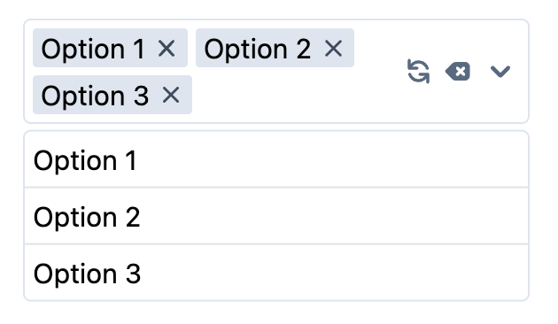

# Lyte

A collection of highly extensible React components, including Selectable, a beautiful (multi)select dropdown you've been looking for.



## Installation

NPM

```bash
npm install @robertzhidealx/lyte
```

Yarn

```bash
yarn add @robertzhidealx/lyte
```

## Selectable

### Import

```js
import { Selectable } from "@robertzhidealx/lyte";
```

### Documentation

| Prop           | Type                                                                         | Requirement | Description                                                                                                                                                                   |
| -------------- | ---------------------------------------------------------------------------- | ----------- | ----------------------------------------------------------------------------------------------------------------------------------------------------------------------------- |
| `width`        | number \| string                                                             | required    | The width of the Selectable component. Either a number corresponding to a number of pixels or `"100%"` to match the width of its parent.                                      |
| `options`      | {label: string \| number; content?: ReactNode \| string}[]                   | required    | The collection of options to select from.                                                                                                                                     |
| `defaultValue` | string \| number \| string[] \| number[]                                     | required    | The label of the value(s) that are selected by default. When `multi` is not specified or set to `false`, `_default ` is a single string or number. Otherwise, it is an array. |
| `multi`        | boolean                                                                      | optional    | Whether Selectable can select multiple options. Defaults to `false`.                                                                                                          |
| `onChange`     | (values: {label: string \| number; content?: ReactNode \| string}[]) => void | optional    | Tracks changes to the selected options. When `multi` is not specified or set to `false`, `values` is a one-item array with the single selected option.                        |
| `allowClear`   | boolean                                                                      | optional    | Whether to show clear button to unselect all options. Defaults to `false`.                                                                                                    |
| `allowRefill`  | boolean                                                                      | optional    | Whether to show refill button to select all options. Defaults to `false`.                                                                                                     |
| `className`    | string                                                                       | optional    | A list of classes applied to Selectable.                                                                                                                                      |

### Example Usage

```ts
import { Selectable } from "@robertzhidealx/lyte";

const SelectableOptions = [
  { label: 1, content: "Option 1" },
  { label: 2, content: "Option 2" },
  { label: 3, content: "Option 3" },
];

const DemoComponent = () => {
  return (
    <Selectable
      width={260}
      multi
      allowClear
      allowRefill
      options={SelectableOptions}
      _default={SelectableOptions.map(({ label }) => label)}
      onChange={(values) => console.log(values)}
    />
  );
};

export default DemoComponent;
```
